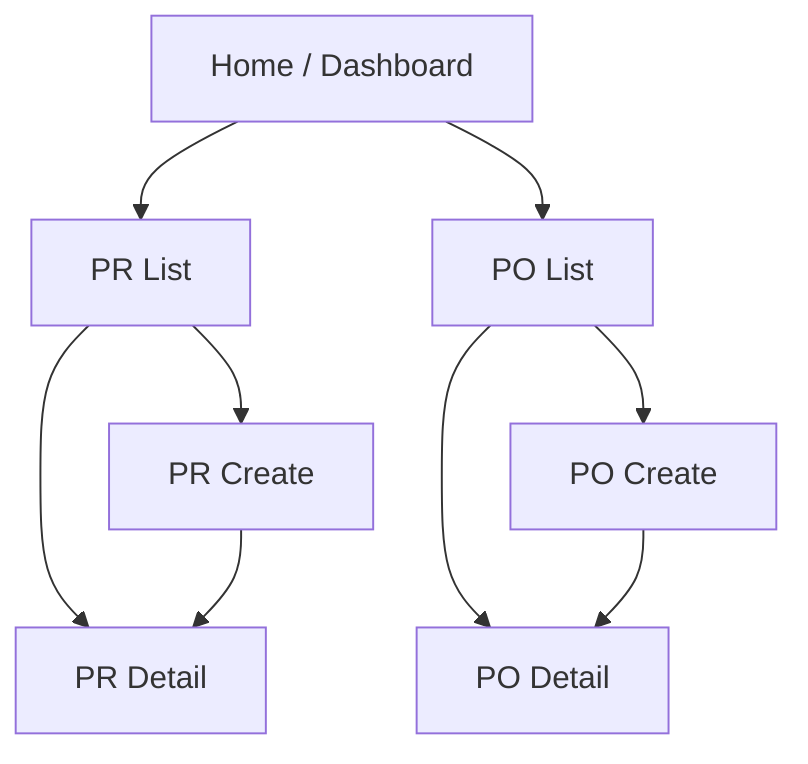
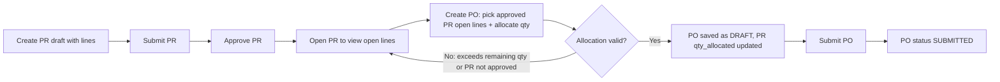
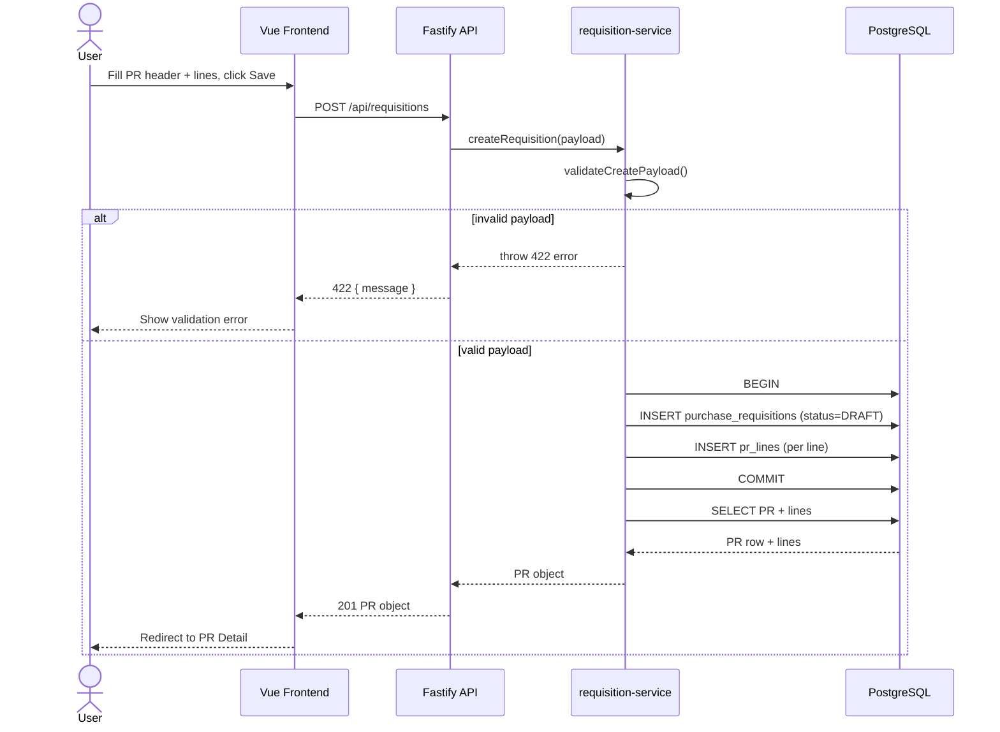
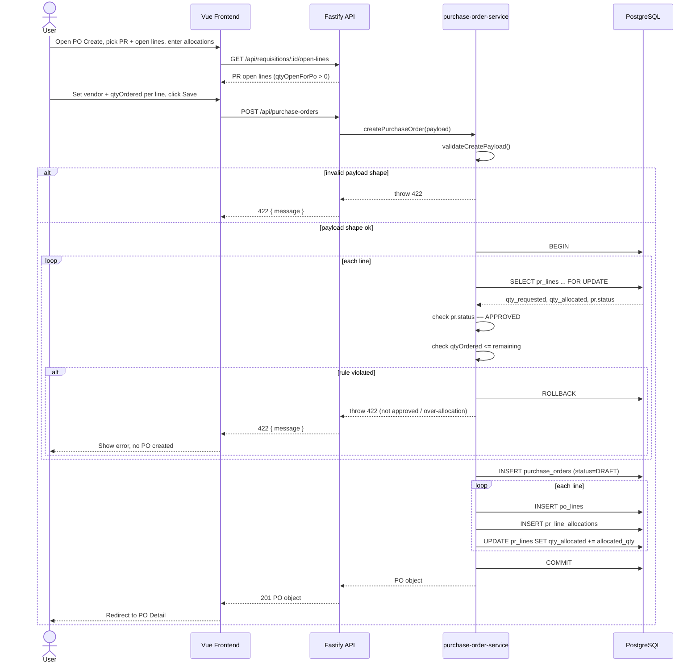
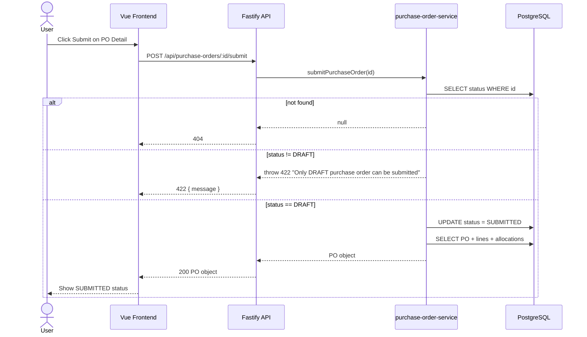

# How the Application Works

Procurement MVP covering Purchase Requisition (PR) and Purchase Order (PO). Goods Receipt (GR) is out of scope for this build (data model exists, no API/UI).

## Stack
- Frontend: Vue 3 + Vite (`frontend/`) calling REST API via `frontend/src/api.js`
- Backend: Fastify REST API (`backend/src/`)
- Database: PostgreSQL (Docker), schema in `db/migrations/001_init_procurement_mvp.sql`

## Modules & Status Lifecycles
- **PR**: `DRAFT -> SUBMITTED -> APPROVED`
- **PO**: `DRAFT -> SUBMITTED`

## Implemented API Endpoints
| Method | Path | Purpose |
|---|---|---|
| GET | `/api/requisitions` | List PRs |
| POST | `/api/requisitions` | Create PR (header + lines) |
| POST | `/api/requisitions/:id/submit` | DRAFT -> SUBMITTED |
| POST | `/api/requisitions/:id/approve` | SUBMITTED -> APPROVED |
| GET | `/api/requisitions/:id` | PR detail with lines |
| GET | `/api/requisitions/:id/open-lines` | PR lines with remaining qty > 0 |
| GET | `/api/purchase-orders` | List POs |
| POST | `/api/purchase-orders` | Create PO from approved PR lines |
| POST | `/api/purchase-orders/:id/submit` | DRAFT -> SUBMITTED |
| GET | `/api/purchase-orders/:id` | PO detail with lines + PR allocation source |
| GET | `/api/purchase-orders/:id/open-lines` | PO lines not fully received |

## Key Business Rule
When creating a PO, each line references a `prLineId`. The service (`purchase-order-service.js`):
1. Locks the PR line row (`FOR UPDATE`).
2. Requires the parent PR status to be `APPROVED`.
3. Requires `qtyOrdered <= (pr_line.qty_requested - pr_line.qty_allocated)`.
4. Inserts the PO + PO lines + a `pr_line_allocations` bridge row, and increments `pr_lines.qty_allocated`, all inside one transaction.

If any line fails validation, the whole PO creation is rejected (422) and nothing is written.

## Pages & Navigation

## End-to-End User Flow

## Sequence: Create Purchase Requisition

## Sequence: Create Purchase Order from Approved PR Lines

## Sequence: Submit Purchase Order

